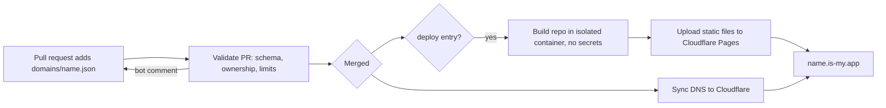

# is-my.app

Free subdomains for your apps: get `your-app-name.is-my.app` with a pull request.

Point it at an app you already host (GitHub Pages, Vercel, Netlify, Cloudflare Pages, your own server), or give us a public GitHub repo and we build and host it for you on Cloudflare Pages.

Browse live apps at [is-my.app](https://is-my.app). The registry is also available as JSON at [`is-my.app/domains.json`](https://is-my.app/domains.json).

## Claim a subdomain for your app

1. Fork this repository.
2. Add `domains/<app-name>.json`. The file name is the subdomain: `domains/pomodoro.json` claims `pomodoro.is-my.app`.
3. Open a pull request. A bot validates it and comments with the result.
4. Valid pull requests are merged automatically, and your app is live within a few minutes.

Your editor autocompletes the format if you keep the `$schema` line.

### Option 1: point DNS somewhere

```json
{
  "$schema": "../schema/domain.schema.json",
  "owner": { "github": "your-username", "email": "optional@example.com" },
  "description": "A focus timer",
  "records": { "CNAME": "your-username.github.io" }
}
```

| Type    | Value                                                                  |
| ------- | ---------------------------------------------------------------------- |
| `A`     | Array of public IPv4 addresses                                         |
| `AAAA`  | Array of public IPv6 addresses                                         |
| `CNAME` | A single hostname. Cannot be combined with any other type              |
| `MX`    | Array of hostnames, or `{ "target": "mx.example.com", "priority": 10 }` |
| `TXT`   | A string or an array of strings                                        |

Set `"proxied": true` to put Cloudflare's proxy (CDN, TLS) in front of an `A`, `AAAA` or `CNAME` record. Only top-level names can be proxied.

### Option 2: we build and host your repo

```json
{
  "$schema": "../schema/domain.schema.json",
  "owner": { "github": "your-username" },
  "description": "A habit tracker",
  "deploy": {
    "repo": "your-username/habit-tracker",
    "branch": "main",
    "build": "npm ci && npm run build",
    "output": "dist"
  }
}
```

| Field    | Default  | Meaning                                                            |
| -------- | -------- | ------------------------------------------------------------------ |
| `repo`   | required | Public GitHub repository, `owner/name`                             |
| `branch` | `main`   | Branch to build                                                    |
| `build`  | empty    | Build command. Leave empty if the files are already static         |
| `output` | `.`      | Folder with the built site, relative to `root`                     |
| `root`   | `.`      | Folder the build runs in (useful for monorepos)                    |
| `node`   | `22`     | Node.js version                                                    |

Hosted apps are redeployed automatically, within about an hour, whenever your branch gets new commits. Hosted apps must use a top-level name (`habits.is-my.app`, not `app.habits.is-my.app`): Cloudflare's free certificate covers one level of subdomain.

## Rules

- One file per name, lowercase `a-z`, `0-9` and `-`. Reserved names (see [`config/reserved.json`](config/reserved.json)) cannot be claimed.
- `owner.github` must be the account that opens the pull request. Only the owner can change or remove a domain.
- Your GitHub account must be at least 14 days old.
- Up to 5 apps (top-level names) per person. Nested names do not count.
- Nested names like `docs.pomodoro.is-my.app` (`domains/docs.pomodoro.json`) are allowed if you own `pomodoro`, for DNS records only (not `deploy` or `proxied`). Nested labels may start with `_` for verification records, like `_dmarc.pomodoro`.
- Records must point to public addresses, and a `CNAME` cannot point back into `is-my.app`.
- No unknown keys: the validator is strict so typos are caught early.
- Everything must follow the [terms](TERMS.md). No phishing, malware or illegal content.

## Using a hosting provider

Most hosts need to know about your custom domain before they will serve it:

- **GitHub Pages:** set the custom domain in your repository settings, then use `"CNAME": "your-username.github.io"`. To verify the domain, add a TXT record as a nested name, e.g. `domains/_github-pages-challenge-your-username.pomodoro.json` with `"records": { "TXT": "<code from GitHub>" }`.
- **Vercel / Netlify:** add `pomodoro.is-my.app` as a domain in the project first, then use the `CNAME` (or `TXT` verification record) they show you.
- **Cloudflare Pages (your own account):** add the custom domain in your Pages project, then point a `CNAME` at `<project>.pages.dev`.

## How it works



- `validate.yml` runs on every pull request. It never runs code from the PR: it reads the changed JSON files through the GitHub API and posts one comment that updates on every push.
- `publish.yml` runs on merge. It reconciles Cloudflare DNS with `domains/`, builds hosted repos, and deploys them. It only touches DNS records it created (tagged with the comment `is-my.app:managed`).
- `site.yml` builds and deploys the website in `web/`.

### Hosted deploy limits

- Static output only. `_worker.js`, `_routes.json` and `functions/` are removed.
- Builds run in the official `node:<version>` Docker image as a non-root user, with a 15 minute limit and no secrets. Use `npx` or `corepack pnpm ...` / `corepack yarn ...` rather than global installs.
- At most 20,000 files, each at most 25 MiB. Symlinks are dropped.
- Redeployed hourly when your branch changes.
- Top-level names only.
- Cloudflare Pages has a soft limit of 100 projects per account, so hosted slots are limited.

## Maintainer setup

1. Add the zone `is-my.app` to Cloudflare.
2. Create three API tokens, each with the least it needs:
   - `CF_READ_TOKEN` (deploy planning): Account > Cloudflare Pages > Read
   - `CF_DNS_TOKEN` (DNS sync): Account > Cloudflare Pages > Read, Zone > DNS > Edit and Zone > Zone > Read on `is-my.app` only
   - `CF_DEPLOY_TOKEN` (hosted deploys and the website): Account > Cloudflare Pages > Edit, Zone > DNS > Edit and Zone > Zone > Read on `is-my.app` only
3. Create a GitHub environment named `cloudflare` whose deployment branches are limited to `main`, and add the three tokens plus `CLOUDFLARE_ACCOUNT_ID` as environment secrets (not repository secrets). Jobs only get secrets when they run from `main`, and the jobs that build or install third-party code never reference the environment.
4. Set the repository variable `AUTO_MERGE` to `true` to merge valid pull requests automatically (`records` and `deploy` PRs; PRs that touch anything outside `domains/` always wait for a maintainer).
5. Keep a ruleset on `main` that blocks force pushes and deletion.
6. Cloudflare Pages permissions cannot be limited to single projects, so the safest setup is a Cloudflare account that holds only `is-my.app`.
7. Remove any parking records at the apex before the first site deploy, or run once:
   `node scripts/pages-attach.mjs is-my-app is-my.app --comment is-my.app:site --force`

Useful commands (all support `DRY_RUN=1`, which reads from Cloudflare but changes nothing):

```sh
npm test                                   # unit tests
npm run validate                           # validate domains/
DRY_RUN=1 npm run sync                     # show the DNS plan
PLAN_MODE=all npm run plan                 # list hosted deploy targets
DRY_RUN=1 node scripts/pages-gc.mjs        # list orphaned Pages projects
```

Run the `Publish` workflow manually with `target` set to `all`, `changed`, `dns` or `name:<subdomain>`. Running it with `all` also deletes Pages projects that no longer have a domain file.

## Reporting abuse

Open an [abuse report](https://github.com/jn-aman/is-my.app/issues/new?template=report-abuse.yml) with the subdomain and what is wrong. For anything sensitive, contact the maintainer privately through [GitHub](https://github.com/jn-aman). Domains that break the [terms](TERMS.md) are removed without notice.

## License

[MIT](LICENSE) © 2026 Aman Jain
